# Phase 2 Exploratory Data Analysis

All tables and figures in this summary are generated from the validated source CSVs. Pathway-relevance counts overlap because a resource can be relevant to more than one pathway.

## Pathway relevance coverage overlaps substantially

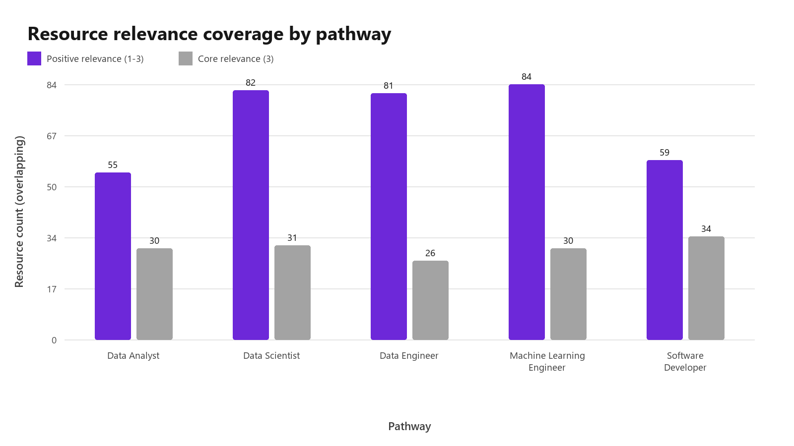

**Finding:** Machine Learning Engineer has 84 resources with positive relevance, while Data Analyst has 55. Counts overlap because one resource may support several pathways.

**Implication:** Pathway-level model results should be interpreted alongside catalogue coverage rather than assuming equal candidate pools.

## The catalogue is concentrated in three providers

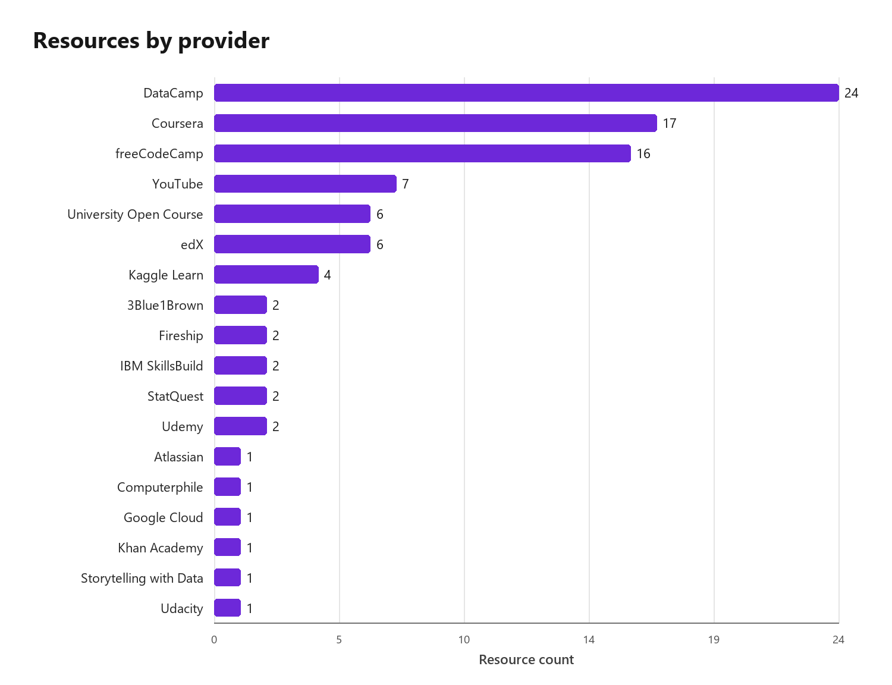

**Finding:** DataCamp contributes 24 of 96 resources (25.0%). The top three providers contribute 57 (59.4%).

**Implication:** Later diversity analysis should check whether recommendations amplify this source concentration.

## Courses dominate the available formats

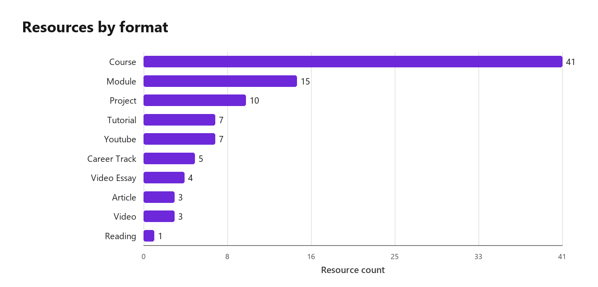

**Finding:** Course is the largest format with 41 resources (42.7%).

**Implication:** Format-diversity results will partly reflect catalogue composition, not only recommender preference.

## Advanced resources are the smallest difficulty group

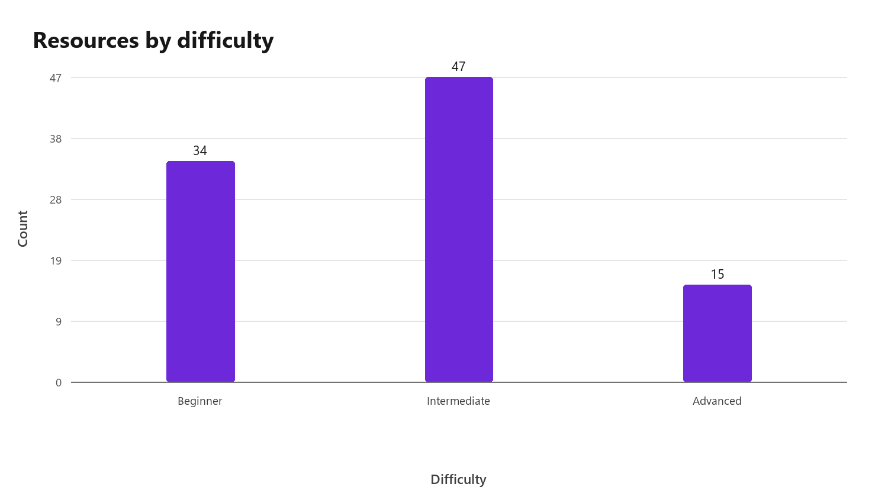

**Finding:** The catalogue contains 34 beginner, 47 intermediate, and 15 advanced resources.

**Implication:** Advanced learners have a smaller candidate pool, which may constrain difficulty matching.

## Most resources are short or medium length

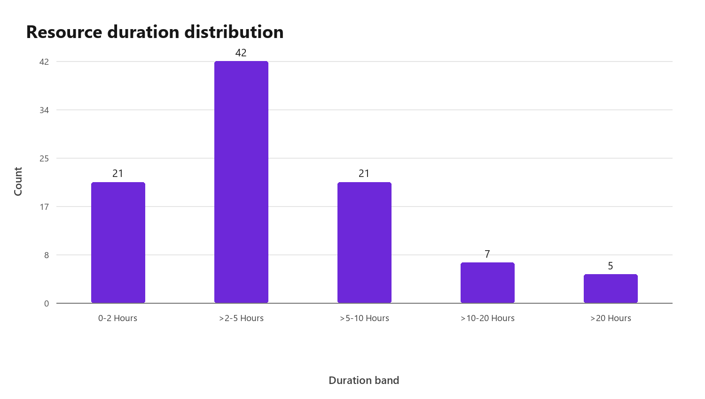

**Finding:** The largest duration band is >2-5 hours with 42 resources (43.8%).

**Implication:** The catalogue broadly supports the project's targeted next-step approach, while long tracks remain a minority.

## Free and paid resources are nearly balanced

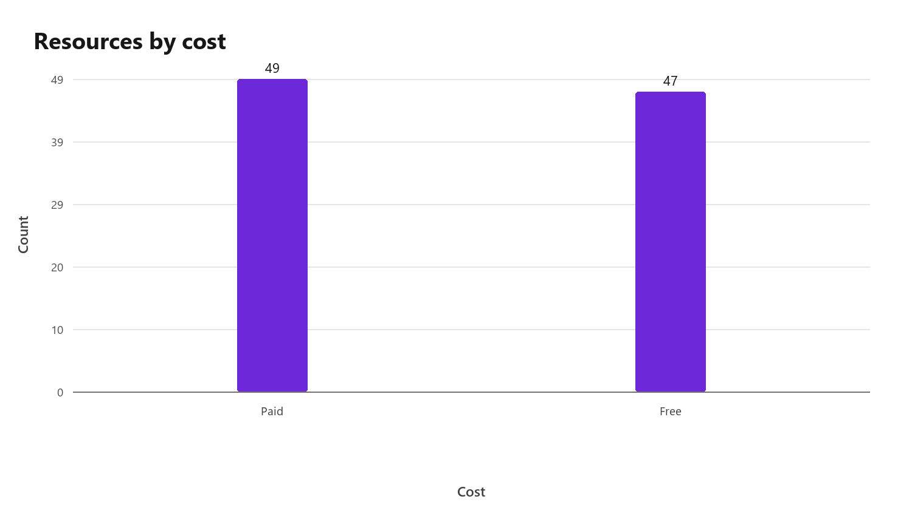

**Finding:** The catalogue contains 47 free and 49 paid resources.

**Implication:** Cost availability is balanced at catalogue level, although cost is not yet a learner preference in the ranking model.

## Skill representation is uneven

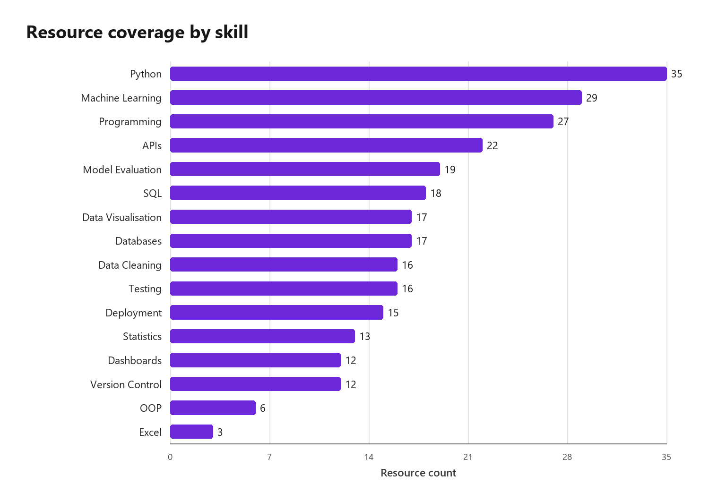

**Finding:** Python appears in 35 resources, while the least represented skill group (Excel) appears in 3.

**Implication:** Low-frequency skills may receive fewer suitable recommendations and need explicit coverage checks.

## Some skills are commonly taught together

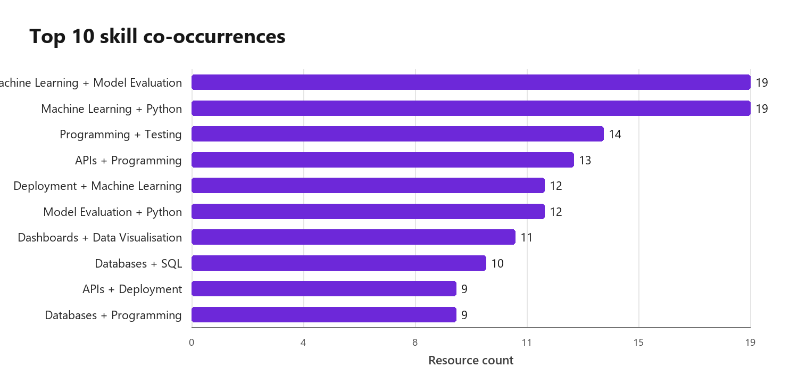

**Finding:** The most frequent pair is Machine Learning with Model Evaluation, appearing in 19 resources.

**Implication:** Co-occurrence can help explain multi-skill recommendations but may also make rare standalone skills harder to retrieve.

## Every required pathway skill has catalogue coverage

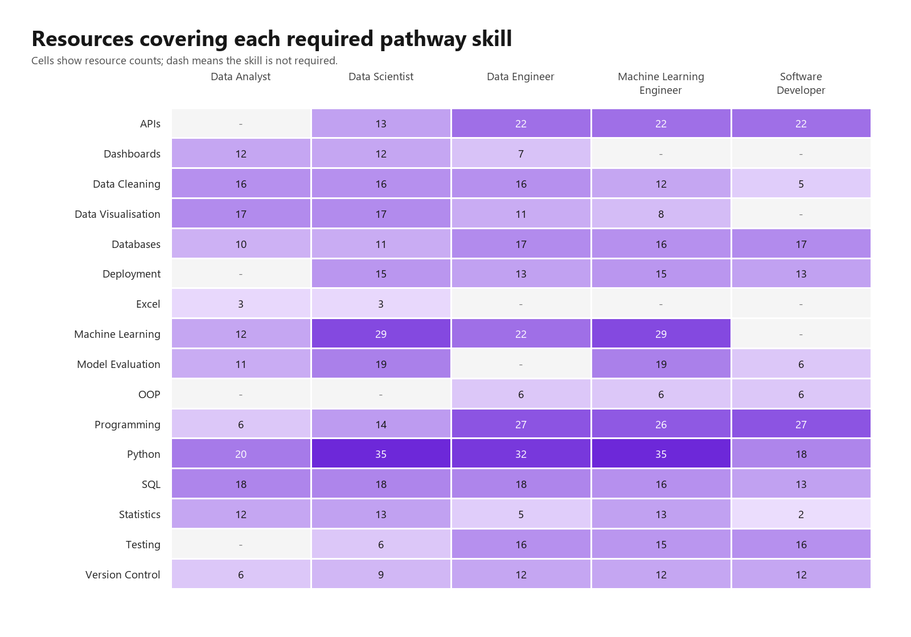

**Finding:** No required pathway-skill cell has zero matching resources. 1 cell has fewer than three resources.

**Implication:** The skill map is usable for recommendation, but thin cells should be reviewed during pathway-level error analysis.

## Evaluation profiles are almost balanced by pathway

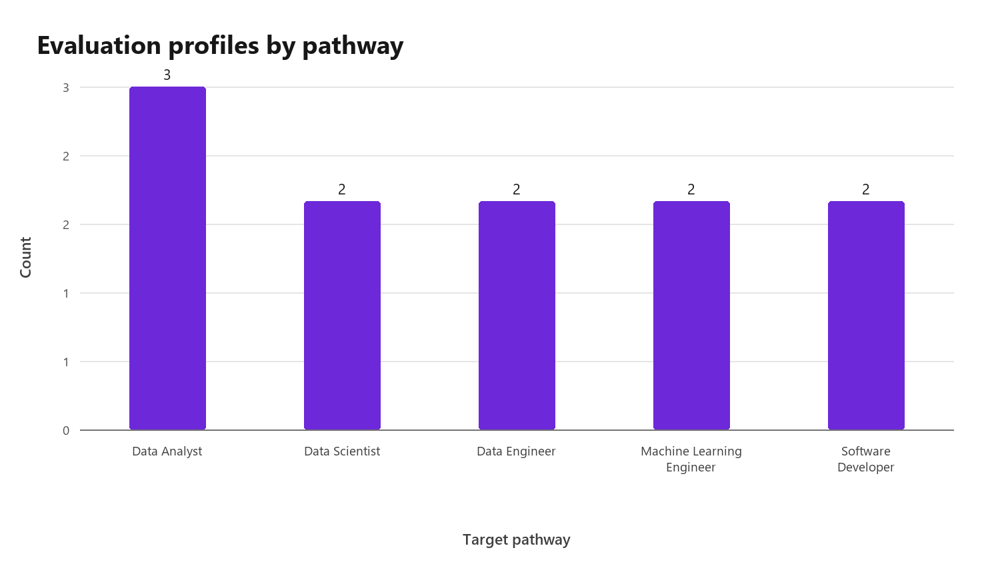

**Finding:** Data Analyst has three profiles; each of the other four pathways has two.

**Implication:** Macro results are not dominated by a large profile group, but 11 profiles remain too few for strong generalisation.

## Relevant-set sizes vary across profiles

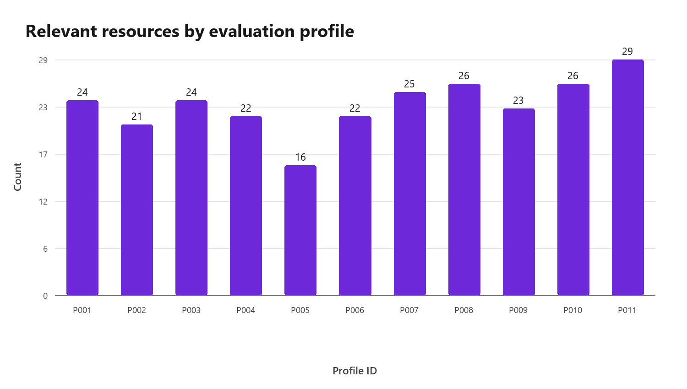

**Finding:** Relevant sets range from 16 to 29 resources, with a mean of 23.5.

**Implication:** Recall@K should be interpreted with relevant-set size, and later evaluation should retain profile-level results.
