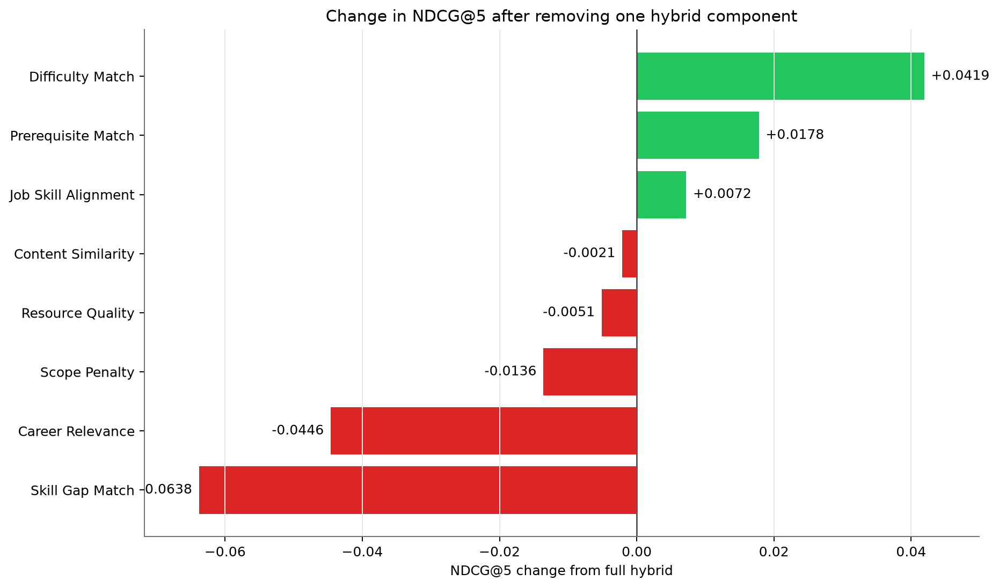
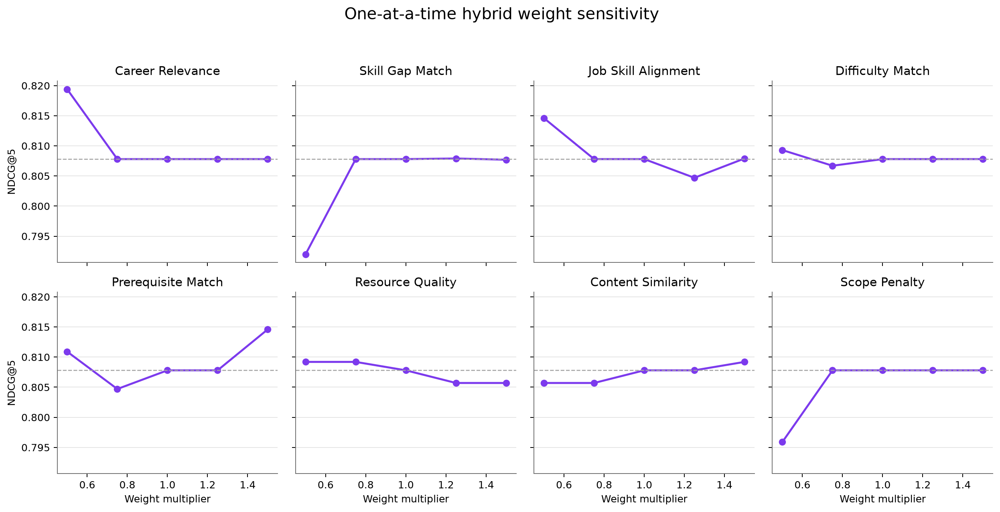
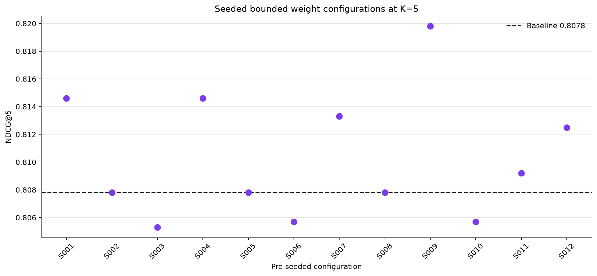
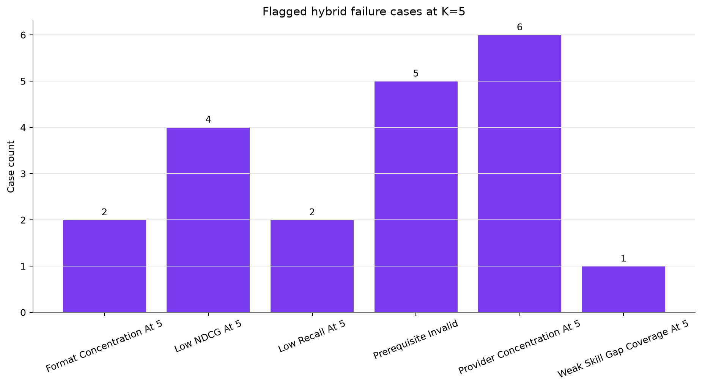

# Phase 4 Hybrid Robustness And Explainability

This analysis uses the unchanged Phase 3 data and baseline hybrid. Ablations and weight variants are diagnostic experiments only; no variant is selected or written back into the production model.

## Ablation identifies which hybrid signals carry the ranking

**Finding:** Removing Skill Gap Match changes NDCG@5 by -0.0638, the largest decrease among single-component removals.

**Implication:** This component contributes the strongest unique ranking evidence on the current curated profiles.

## Some component removal may improve the same test set

**Finding:** The largest ablation increase is +0.0419 when Difficulty Match is removed. For Data Engineer profile P010, NDCG@5 changes from 0.3492 to 0.4273.

**Implication:** This is diagnostic evidence, not permission to retune on the evaluation profiles; a change needs held-out confirmation.

## One-at-a-time sensitivity measures local stability

**Finding:** Skill Gap Match has the widest NDCG@5 range (0.0159) across 0.5x to 1.5x its current weight.

**Implication:** Large local variation would indicate a fragile manual weight; small variation indicates stable rankings near the chosen value.

## Seeded alternatives test robustness without tuning

**Finding:** Twelve pre-seeded configurations produce NDCG@5 values from 0.8053 to 0.8198.

**Implication:** The range describes sensitivity to bounded joint perturbations; the best variant is not selected as a replacement model.

## Failure cases point to model changes before data expansion

**Finding:** 5 prerequisite-invalid top-five recommendations affect 2 profiles; the complete failure log contains 20 flagged cases.

**Implication:** A hard eligibility or sequencing rule can be evaluated before assuming that additional catalogue rows are the primary remedy.

## The current evidence supports a model-first data decision

**Finding:** All source rows remain valid, the strongest controlled improvement comes from a scoring-component change, and prerequisite failures come from soft ranking rather than broken data references.

**Implication:** Keep the current dataset as the experimental baseline, evaluate hard prerequisite eligibility and independently review labels, then create a documented data revision only if residual errors show a genuine catalogue or labelling gap.
