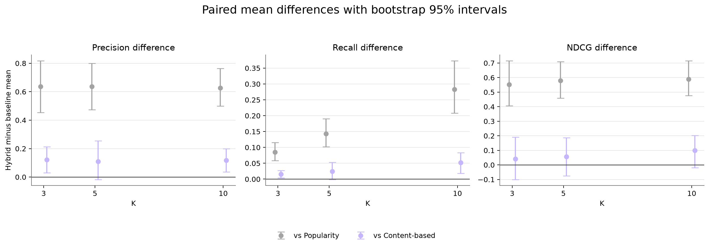
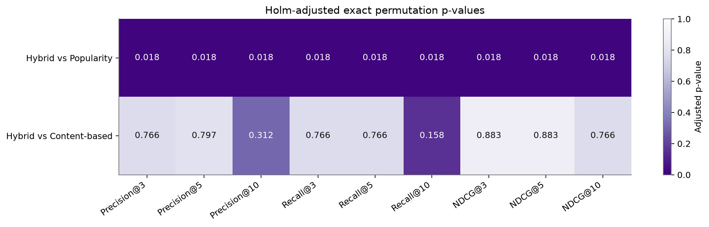
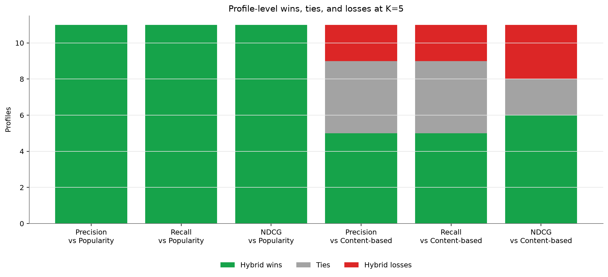
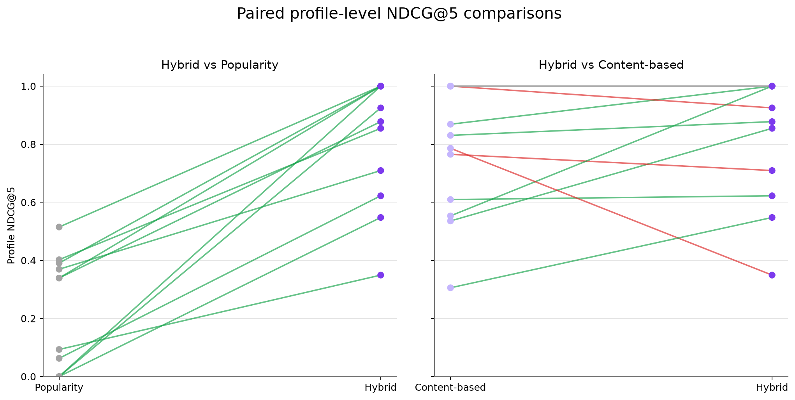

# Phase 5 Paired Statistical Comparison

The hybrid is compared with each baseline using differences calculated within the same 11 profiles. Exact sign-flip permutation tests are the primary tests; exact signed-rank tests are a sensitivity check. Holm correction covers all 18 planned model-metric-K comparisons. These results describe the curated evaluation set and do not establish population-wide performance.

## Paired differences quantify the hybrid advantage

**Finding:** At K=5, hybrid minus content-based NDCG averages +0.0574 with 95% interval [-0.0757, +0.1863], while the Holm-adjusted exact permutation p-value is 0.882812.

**Implication:** The positive mean is suggestive on this test set, but it is not corrected statistical evidence that hybrid outperforms content-based.

## The popularity comparison is practically large

**Finding:** At K=5, hybrid minus popularity NDCG averages +0.5795 with paired standardized effect dz=2.6077 and Holm-adjusted exact permutation p=0.017578.

**Implication:** Practical magnitude is reported alongside p-values rather than treating statistical significance as the only evidence.

## Corrected tests separate the two baseline conclusions

**Finding:** 9 of 18 planned hybrid-baseline comparisons have Holm-adjusted exact permutation p<0.05: 9 of 9 against popularity and 0 of 9 against content-based.

**Implication:** Only corrected results can support statistical claims; all conclusions remain limited to 11 curated profiles.

## Win, tie, and loss counts expose consistency

**Finding:** For NDCG@5, hybrid records 6 wins, 2 ties, and 3 losses against content-based.

**Implication:** The counts show whether an average difference is widespread or driven by a small number of profiles.

## A blinded label audit is prepared but not fabricated

**Finding:** A deterministic 40-item audit template contains 8 cases per pathway and spans all four planned case types. 7 balanced fallback cases were needed because recommended-but-currently-non-relevant cases were not numerous enough for a perfect two-per-type split in every pathway. Reviewer fields are blank and the current-label key is stored separately.

**Implication:** An independent reviewer can assess label consistency without seeing model scores or the current labels.
