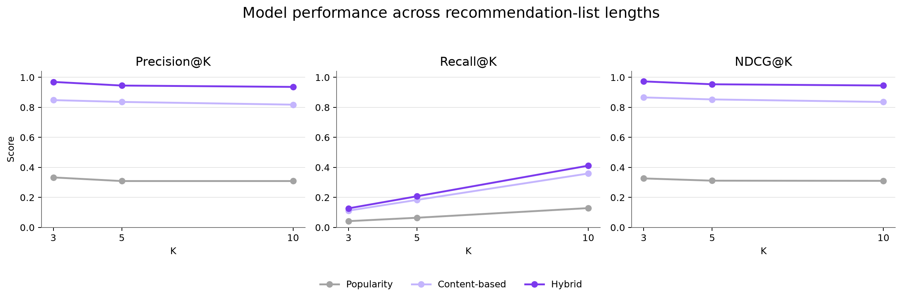
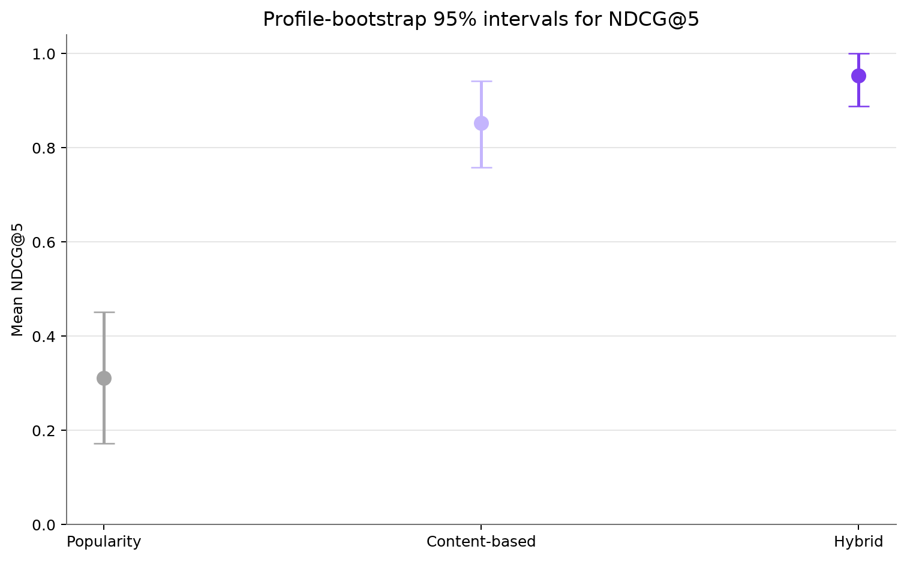
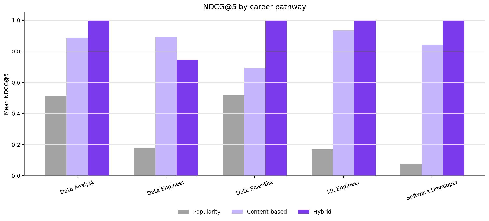
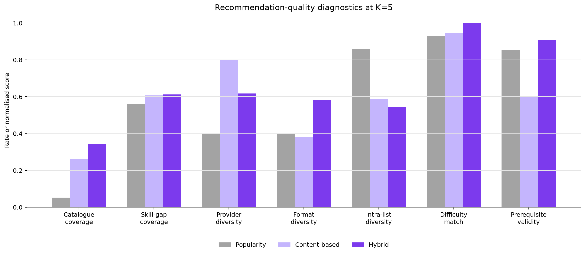

# Phase 3 Broader Offline Evaluation

All metrics are generated from the fixed validated catalogue, 11 curated profiles, and their relevance judgements. Bootstrap intervals resample profile-level metric rows with a recorded seed; they do not represent uncertainty for the real learner population.

## The hybrid remains the strongest model at K=5

**Finding:** Hybrid has the highest macro NDCG@5 at 0.9540.

**Implication:** The structured career and skill-gap signals remain useful when performance is traced to profile-level observations.

## The overall estimate still has profile-level uncertainty

**Finding:** Hybrid NDCG@5 has a seeded profile-bootstrap 95% interval of [0.8885, 1.0000].

**Implication:** The interval describes variation within 11 curated profiles, not uncertainty for the real learner population.

## Pathway performance is not uniform

**Finding:** The lowest hybrid pathway NDCG@5 is Data Engineer at 0.7469; Content-based scores 0.8930 for the same pathway.

**Implication:** Pathway-level error analysis is needed before treating the overall average as equally representative of every pathway.

## The hybrid covers only part of the full catalogue

**Finding:** Across all profiles at K=5, hybrid recommendations expose 33 of 96 resources (34.4%).

**Implication:** Coverage should be interpreted alongside the deliberate exclusion of broad tracks and supporting-only formats from ranked next steps.

## Suitability diagnostics provide a second evaluation layer

**Finding:** At K=5 the hybrid averages 61.3% skill-gap coverage, 100.0% difficulty matching, and 90.9% prerequisite validity.

**Implication:** High relevance metrics should only be accepted when recommendations also address learner gaps and remain teachable.
