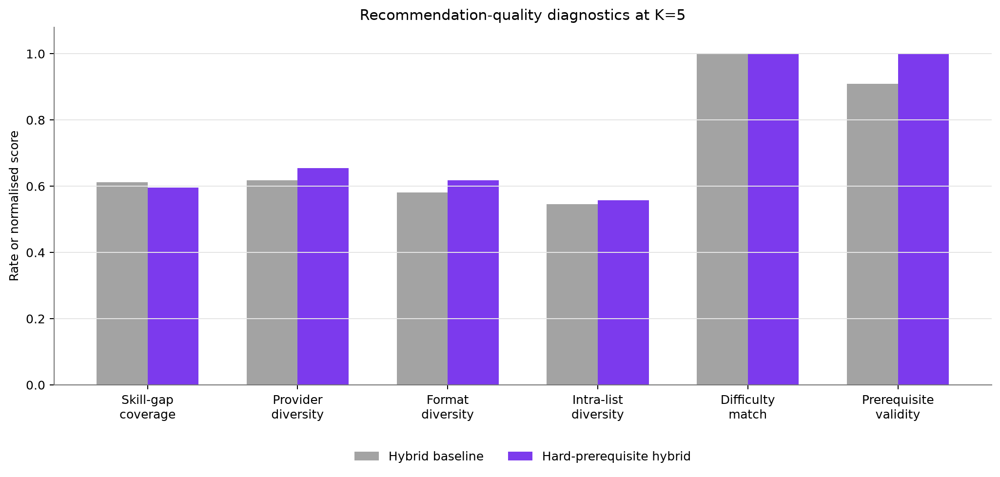
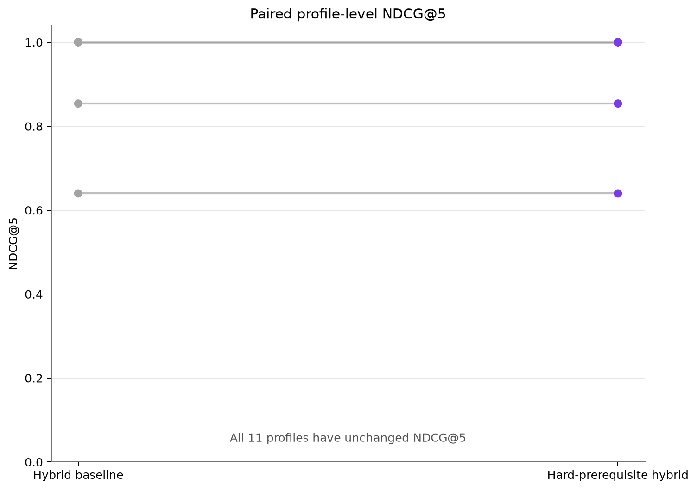
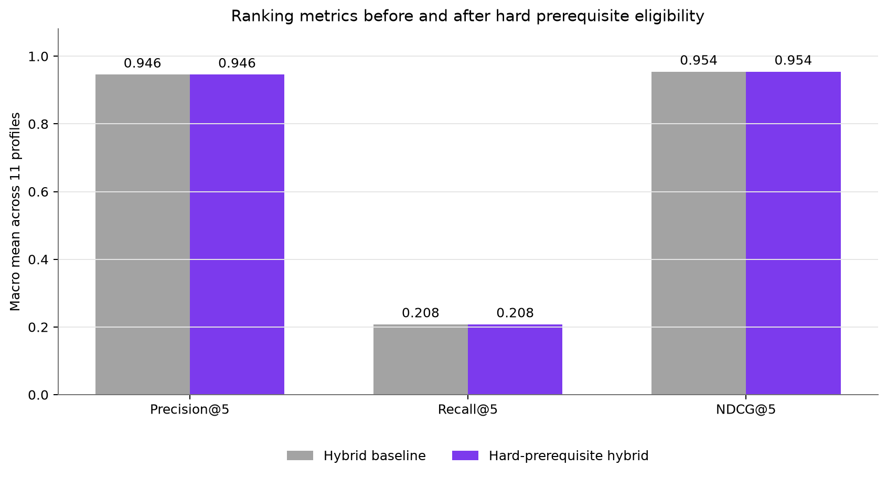

# Hard-Prerequisite Eligibility Experiment

The experimental variant changes only candidate eligibility: a resource is ranked only when every prerequisite is completed or recorded at skill level 1 or above. Hybrid weights, scores, source data, relevance labels, and the baseline are unchanged. NDCG@5 is primary; Precision@5 and Recall@5 complete the three-test Holm family. Results remain limited to 11 curated profiles.

## Hard eligibility removes prerequisite-invalid recommendations

**Finding:** Mean prerequisite validity at K=5 changes from 90.9% to 100.0%.

**Implication:** The candidate-level rule directly addresses the diagnosed suitability failure while preserving a full top-10 list.

## The primary ranking effect is measured rather than assumed

**Finding:** Hard eligibility minus baseline NDCG@5 averages +0.0000 with 95% interval [+0.0000, +0.0000], 0 wins, 11 ties, 0 losses, and Holm-adjusted exact p=1.000000.

**Implication:** Suitability and relevance are reported together; neither one is treated as sufficient by itself.

## Profile changes expose who is affected

**Finding:** 6 of 11 profile top-10 rankings change. Top-five resource identities change for 2 profiles (P003, P008). Profiles with lower NDCG@5 are none.

**Implication:** The aggregate result is traceable to explicit removed and replacement resources for every profile.

## Pathway effects remain descriptive

**Finding:** The lowest pathway NDCG@5 change is data_analyst at +0.0000.

**Implication:** Only two or three profiles represent each pathway, so this diagnostic cannot support pathway-wide generalisation.

## Longer lists and quality diagnostics show small trade-offs

**Finding:** At K=10, NDCG changes from 0.9457 to 0.9455. At K=5, skill-gap coverage changes from 0.6126 to 0.5956, while catalogue coverage changes from 0.3438 to 0.3854.

**Implication:** The hard rule improves eligibility and broader exposure, but slightly reduces measured skill-gap coverage at K=5; this trade-off should be reviewed rather than hidden.

## The baseline remains frozen

**Finding:** The experiment changes only candidate eligibility. Source data, relevance labels, hybrid weights, and baseline outputs remain unchanged.

**Implication:** The result can inform a later implementation decision, but does not automatically replace the production hybrid.
